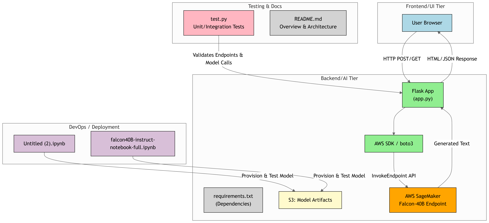

# Generative AI With Cloud

This project demonstrates how to use **AWS Bedrock** with **LLaMA2**, **S3**, and **AWS Lambda** to build a blog-generation platform powered by generative AI. It includes a web interface using Flask and backend components that connect to AWS services.

---

## 🧠 Features

- Generate 200-word blogs using Meta LLaMA2 (via AWS Bedrock)
- Trigger blog creation through a Flask web app or an AWS Lambda function
- Save blog content in AWS S3
- Modular Python functions for easy integration and extension.

## 📊 Architecture


### Flow Description

1. User enters a blog topic in the web app (Flask).
2. Flask calls an API or Lambda handler.
3. Lambda function triggers:
    - **AWS Bedrock** with **Meta LLaMA2** to generate the blog
    - Saves the blog to **Amazon S3**
4. User receives confirmation.
## 🛠️ Setup Instructions

### Prerequisites

- Python 3.8+
- AWS Account with SageMaker access
- Virtual environment (recommended)

### Clone the Repository

```bash
git clone https://github.com/<your-username>/Generative-AI-With-Cloud.git
cd Generative-AI-With-Cloud


